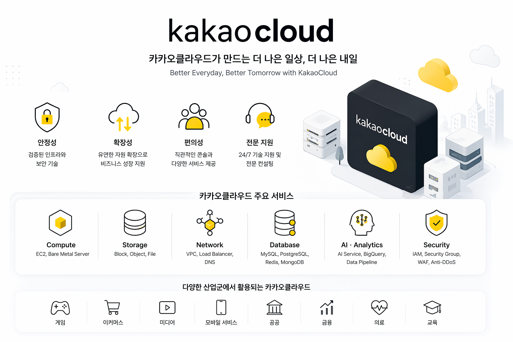

# Kakaocloud Repository

🔗 Blog: [Kakaocloud 자료](https://lucky-gun.com/tag/kakaocloud/)

이 저장소는 Kakaocloud 학습, 실습, 그리고 실제 운영 환경 구성을 기록한 공간입니다.

## 📂 Repository Structure

### 🧪 Hands_On_Guide (카카오 클라우드 사용 가이드)
| 디렉토리 | 설명 |
|----------|------|
| k8s-infra-setup | Kubernetes 클러스터 구축 과정 (ver1, ver2) |
| my-website | CI/CD 기반 인프라 구조 배포 (gitops) |
---

### ⚡ Tutorial (실습 & 실험)
| 디렉토리 | 설명 |
|----------|------|
| fast_installation | 빠른 구축을 위한 간단한 코드 정리 |

---

### 🔑 data (카카오클라우드 관련 자료)
| 디렉토리 | 설명 |
|----------|------|
| deploy-manifests | 빠른 구축을 위한 간단한 코드 정리 |
